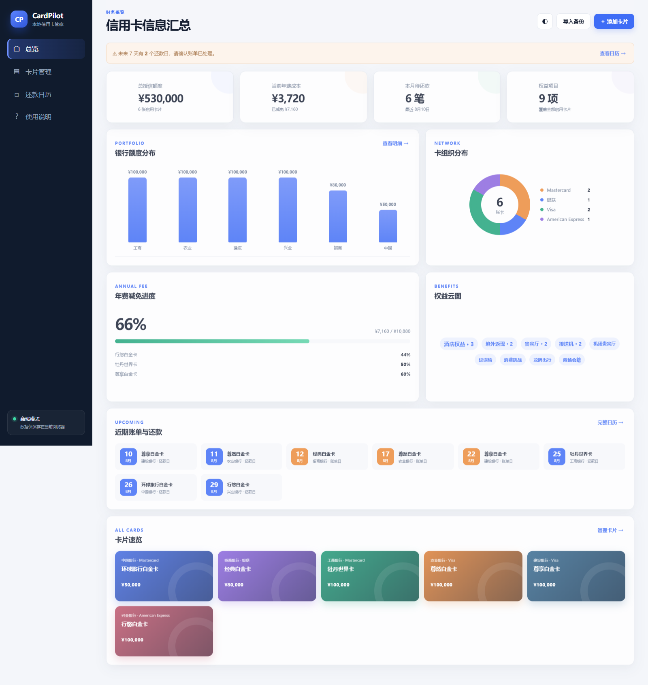

# CardPilot 本地信用卡管理

一个离线优先、无需注册的信用卡管理应用，用来替代飞书多维表格中的信用卡仪表盘。程序本身是纯静态网页，可在 Windows、macOS 和 Linux 的现代浏览器中运行，也适合直接托管到 GitHub Pages。




## 功能

- 信用卡资料新增、编辑、停用和删除
- 总授信额度、年费成本、银行额度、卡组织与权益统计
- 账单日和还款日月历、未来 7 天提醒
- 年费减免进度追踪
- 搜索、筛选和排序
- JSON 完整备份、JSON 恢复和 CSV 导出
- 明暗主题与移动端适配
- 数据默认只保存在当前浏览器的 `localStorage`

## 本地运行

Windows 用户双击根目录中的 `start.bat`；也可以直接打开 `source/index.html`。

首次打开会载入匿名示例数据。添加自己的卡片后，数据自动保存在当前浏览器。建议定期在“卡片管理”中导出 JSON 备份。

## 隐私说明

请勿在应用里记录完整卡号、有效期、CVV、安全码、密码或短信验证码。代码仓库只包含匿名示例数据；本地备份应放入 `data/private/` 或 `outputs/private/`，这些目录已被 Git 忽略。

清除浏览器站点数据可能会删除本地卡片，因此真实使用前请先测试“导出备份”和“导入备份”。

## 发布到 GitHub Pages

应用源文件位于 `source/`。如果需要发布为 GitHub Pages 网站，可以使用 GitHub Actions 将该目录部署到 Pages；仓库上传完成后再启用即可。

注意：GitHub Pages 只托管程序文件；卡片数据仍保存在每位访问者自己的浏览器中，不会随代码上传。

## 项目结构

```text
source/
  index.html       应用界面
  styles.css       响应式样式
  app.js           数据、统计、日历与导入导出逻辑
docs/              项目文档
data/private/      本地私密数据（不会提交）
outputs/private/   本地导出文件（不会提交）
start.bat          Windows 快速启动入口
```
